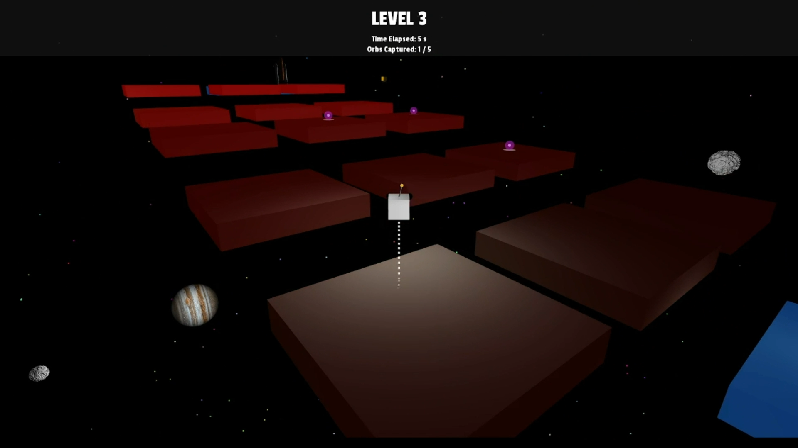

# Space Escape!

_Screenshot taken from the game_

## About This Game Concept

I created this 3D game in C++ as part of my university coursework for the module: "Games Computing".

Space Escape! is a concept for a 3D platformer game where the player controls a robot lost in outer space. The player must navigate various obstacles and challenges in the environment to get to the rocket and escape back to Earth. The game has multiple levels and collectable items, and the goal for the player is to reach the end of the level without falling into the void.

## Implementation Details

I used Qt Creator and C++ to develop this game, and used two open-source middleware components:
- **openFrameworks** for providing graphics functionality including dynamic lighting and rendering objects
- **Open Dynamics Engine (ODE)** for the underlying physics engine which handled collisions between the player and platforms

## Game Features
- 3D scenery including rotating planets, asteroids, and satellites and a 3D robot. I
found the models for the planets and asteroids online, and I modelled the satellite and
robot myself using Blender.
- Animated space background and level transitions.
- Applies incremental game difficulty with various challenges, including static, moving,
rotating, and disappearing platforms.
- Features collectable energy orbs, which animate and are randomly distributed within
each level.
- Uses dynamic lighting in the scene, including setting emissive light material properties
for the platforms and a spotlight which follows and illuminates the player as they move.
- Features background music and sound effects for when the player falls, jumps and
collects an orb.

## How to Play

Press any key to start the game.

- The W and S keys will move the player forward and backward.
- The A and D keys will rotate the player left and right.
- Press the spacebar to jump.
- Collect orbs by moving towards them.
- You can change the camera's pitch using the left and right arrows and the camera’s zoom level using the up and down arrows.

There are currently 3 levels, and once the player reaches the rocket, the game will transition to the next level.

